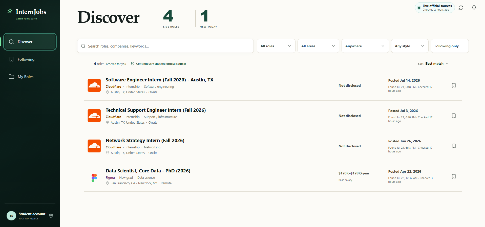

# Job Monitor

Job Monitor is a full-stack application that monitors official company hiring sources to help computer science students discover internships and new-grad roles before they miss them.



Unlike general job boards and community-maintained lists, Job Monitor treats employer career systems as the source of truth. It preserves publication dates, detects posting changes and closures, and keeps saved application history after a role disappears.

## Why I built it

Students often track companies through spreadsheets, GitHub lists, Discord servers, and individual career pages. This makes it easy to discover openings late, forget a company, or confuse an older listing with a newly published one.

Job Monitor is designed to:

- Monitor official employer hiring sources
- Identify technical internships and explicit new-grad roles
- Separate employer publication time from monitor discovery time
- Organize followed companies, saved roles, and applications
- Preserve application history after postings close

## Current features

### Source monitoring

Live monitoring is currently enabled for the Greenhouse boards of:

- Cloudflare
- Figma
- Databricks

Every source is normalized into a shared internal job model. Ashby and Lever adapters are also implemented and tested but are not yet enabled in the reviewed live-source catalog.

### Early-career classification

A deterministic classifier evaluates:

- Internship and new-grad language
- Software engineering, data science, ML/AI, networking, and infrastructure roles
- Degree and graduation-year requirements
- United States eligibility
- Compensation and work-style information

Postings are classified as included, excluded, or review-required so uncertain roles are not silently presented as valid matches.

### Posting lifecycle tracking

Job Monitor tracks postings across repeated source checks and supports:

- Duplicate prevention
- Idempotent updates
- Content-change detection
- First-seen and last-seen timestamps
- Closure confirmation across multiple successful scans
- Reopening detection using stable source IDs
- Preservation of saved and applied roles after closure

Failed, partial, malformed, protected, or suspiciously empty scans cannot close active jobs.

### Student workspace

The React interface includes:

- Discover
- Following
- My Roles
- Search and filtering
- Saved opportunities
- Application-stage tracking
- Role and company details
- Source-health information

## Engineering highlights

### Bulk-first ingestion

Large company career boards can contain hundreds of unrelated positions. The ingestion pipeline performs a description-aware bulk request, classifies postings in memory, and requests individual job details only for possible student or early-career roles.

For the Databricks Greenhouse board, this reduced initial ingestion from:

- **802 requests to 6 requests**

Repeat scans normally require only one bulk-board request when no qualifying posting has changed.

### Compact posting ledger

The database separates source monitoring from product-facing job records.

Every posting receives a compact ledger entry containing its stable identity, content hash, classification state, observation timestamps, and lifecycle state. Full descriptions and normalized job data are stored only for included or review-required roles.

This reduced the live SQLite database from:

- **94 MB to 1.65 MB**
- **1,235 full records to 5 materialized relevant records**

All **1,235 posting IDs** remain tracked for changes, closures, and reopenings.

### Timestamp integrity

Job Monitor stores four separate timestamps:

- `source_published_at` — when the employer published the role
- `source_updated_at` — when the employer last updated it
- `first_seen_at` — when the monitor first detected it
- `last_seen_at` — the latest successful observation

This prevents an older posting discovered today from being incorrectly displayed as newly published.

## Architecture

```text
Company hiring systems
        ↓
Source adapters
        ↓
Classification and extraction
        ↓
Compact posting-state ledger
        ↓
Relevant job materialization
        ↓
Express API
        ↓
React interface
```

Monitoring runs independently from user-facing API requests, preventing a slow or unavailable employer source from blocking the application.

## Technology

### Application

- React
- TypeScript
- Node.js
- Express
- SQLite
- Vite

### Data pipeline

- Greenhouse public Job Board API
- Ashby and Lever source adapters
- Deterministic job classification
- Compensation and requirement extraction
- Posting lifecycle and source-health monitoring
- Versioned database migrations

### Testing and quality

- Vitest
- Testing Library
- Supertest
- ESLint
- TypeScript type checking
- Production build validation

The project contains more than **200 tests** covering classification, ingestion, lifecycle behavior, persistence, API responses, and interface rendering.

## Run locally

### Requirements

- Node.js 22 or newer
- npm

```bash
git clone https://github.com/Orbe1/official-job-monitor.git
cd official-job-monitor
npm ci
npm run dev
```

Open the application at:

```text
http://127.0.0.1:5173/discover
```

Run the complete validation suite:

```bash
npm run check
```

This runs linting, type checking, automated tests, and the production build.

## Current status

Job Monitor is a working local prototype using live public Greenhouse data.

Currently:

- SQLite is the configured database
- Authentication uses a local development identity
- Monitoring is local and rate-limited
- Notifications and email delivery remain development-only
- No public deployment is currently available

Planned milestones include enabling reviewed Ashby sources, adding continuous integration, and creating a public read-only deployment.

## Documentation

- [Architecture](docs/ARCHITECTURE.md)
- [Monitoring behavior](docs/MONITORING.md)
- [Implementation status](IMPLEMENTATION_STATUS.md)
